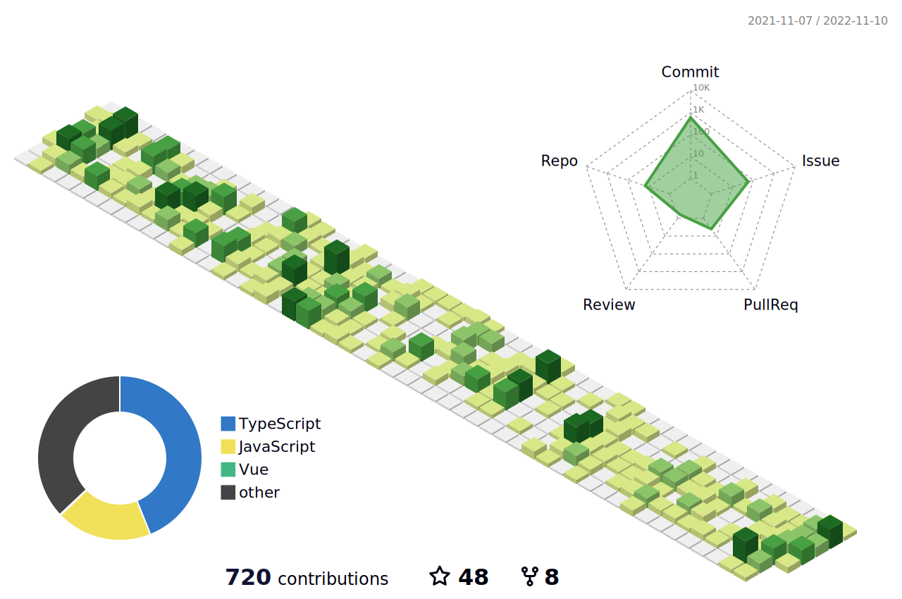

Thank you for your visit.

  I'm a frontend engineer. now lives in Chengdu.
  
  LeetCode：[thomas](https://leetcode-cn.com/u/web_thomas/) | issuze: [Blog](https://github.com/thomas-void0/blog)
  
  Here is a track of my activity on github：

<!--  -->

  

  Here are some of the projects I've done on github：

  [cta-template-admin](https://github.com/thomas-void0/cta-template-admin): a react template, supprot keepalive， route tab drag and more.

  [th-gather](https://github.com/thomas-void0/th-gather): a tracking script.

  [t2t-tools](https://github.com/thomas-void0/t2t-tools): a typescript type tools lib.

  [fool-deploy](https://github.com/thomas-void0/fool-deploy): a fast way to deploy web app in linux server env.

  [th-run-cli](https://github.com/thomas-void0/th-run-cli): a cli lib, It can fast generate react mobile project.

  [create-template-app](https://github.com/thomas-void0/create-template-app): a cli lib, fast generate react project.

  [fake-fingerprint](https://github.com/thomas-void0/fake-fingerprint): generate fake fingerprint of browser.

  [custom-protocol-detection-pkg](https://github.com/thomas-void0/custom-protocol-detection-pkg): npm package of custom-protocol-detection. you can use it check custom protocol whether installed in your device.
  

<!-- **profile-3d-contrib**  

 -->
  
  

